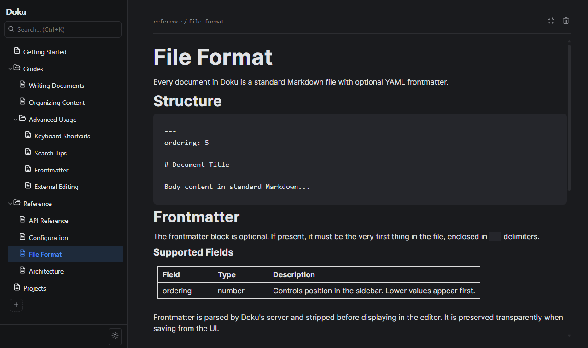

<p align="center">
  
</p>

# Doku

A personal documentation system that stores docs as plain Markdown files and provides a web UI with hierarchical navigation, WYSIWYG editing, and full-text search.

## Features

- **Markdown-first** — all documents are standard `.md` files on disk, editable with any tool
- **WYSIWYG editor** — Notion-style block editor (BlockNote) with no raw Markdown editing
- **Hierarchical folders** — organize docs in nested folders with a collapsible sidebar tree
- **Full-text search** — search bar at the top of the sidebar with highlighted snippets
- **Auto-save** — changes save automatically (1-second debounce)
- **Live reload** — external file changes are detected and reflected instantly in the browser
- **Dark mode** — toggle at the bottom of the sidebar, preference saved
- **Image support** — drag and drop images with width and alignment preserved
- **Width toggle** — switch between narrow and full-width document view
- **Table of contents** — floating heading outline on the right, hover to expand and navigate
- **Page emoji** — set a custom emoji icon per document, shown in the sidebar and at the top of the page
- **No database** — the filesystem is the single source of truth

## AI-Friendly

Doku is designed to work well with AI agents and coding assistants:

- **Plain Markdown** — all docs are standard `.md` files that AI agents can read and write directly
- **CLAUDE.md** — project conventions and rules for AI assistants working on the codebase
- **AGENTS.md** — detailed instructions for AI agents creating, editing, and organizing documentation files (frontmatter rules, folder conventions, ordering guidelines)
- **Simple file structure** — no database, no binary formats, no proprietary storage. Just files and folders that any tool can work with
- **CLI init** — agents can scaffold new doc projects with `npx dokudocs init ./path`
- **REST API** — all operations available via HTTP endpoints for programmatic access

## Quick Start

```bash
# Initialize a new docs folder
npx dokudocs init ./my-docs

# Start the server
npx dokudocs ./my-docs
```

Open `http://localhost:4782` in your browser.

## Development Setup

```bash
# Clone the repo
git clone https://github.com/romasm/Doku.git
cd Doku
npm install
git submodule update --init

# Start in development mode (two terminals)
node server/index.js          # Backend on port 4782
npx vite                      # Frontend on port 5173 with hot reload

# Run tests
npm test

# Or build and run in production
open_docs.bat                 # Windows
./open_docs.sh                # macOS/Linux
```

## Configuration

Edit `config.json` inside your docs folder:

```json
{
  "projectName": "My Knowledge Base",
  "port": 4782
}
```

| Field | Type | Default | Description |
|-------|------|---------|-------------|
| projectName | string | "Doku" | Name displayed at the top of the sidebar |
| port | number | 4782 | Port the backend server listens on (also overridable via `PORT` env var) |

## Folder Convention

Doku uses a sibling-file convention for folders:

```
docs/
├── getting-started.md        # standalone document
├── guides.md                 # folder index (sibling of guides/)
├── guides/
│   ├── writing-docs.md
│   └── organizing-content.md
├── config.json               # project configuration
└── assets/                   # uploaded images
```

- Every folder needs a sibling `.md` file with the same name as its index page
- Click **+** on any document to convert it into a folder with a child doc
- When the last child is deleted, the empty folder is automatically removed

## Frontmatter

Documents support optional YAML frontmatter for metadata:

```markdown
---
ordering: 1
---
# My Document

Content here...
```

- `ordering` — controls position in the sidebar (lower values first, unordered items last)
- Frontmatter is completely hidden in the editor UI and preserved on save

## Tech Stack

- **Backend:** Node.js, Express 5
- **Frontend:** React 19, Vite 8, React Router v7
- **Editor:** BlockNote with Mantine
- **Icons:** Animated SVG icons ([pqoqubbw/icons](https://github.com/pqoqubbw/icons))

## License

MIT
